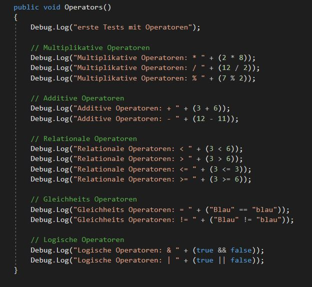
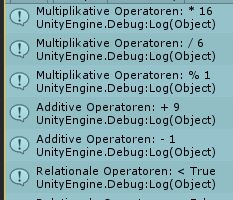

# ProgBasics-kkoenig

**Progress:** 20%

### Development Platform
- OS: Windows 10
- Unity Version: 2018.2.14f1
- Visual Studio Version: 2017 15.9.4
- Scripting Runtime: .NET 35 Equivalent
- API Compatility: .NET 2.0 Subset

### Description
- **Tests Operatoren:** Mit Debug.Log in einem C# Script werden verschiedene Operatoren (Multiplikativ, Additiv, Relational, Gleichheits und Logisch) in die Unity Console geschrieben.
- **Tests Methoden:** Verschiedene Methoden wurden erstellt und in der Unity Console verschachtelt als auch normal ausgelesen. (Return type, Parameter) 
- **Tests Variablen:** Zuweisen und Überschreiben unterschiedlicher Variablen-Typen. 

### Screenshots
- Operators Code

  

- Unity Console

  

### Lessons Learned
- Umgang mit Variablen und Methoden in C#

Copyright by Kathrin König

